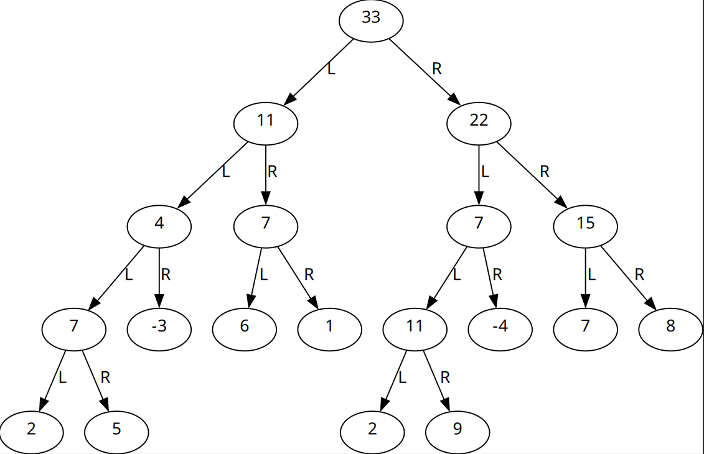
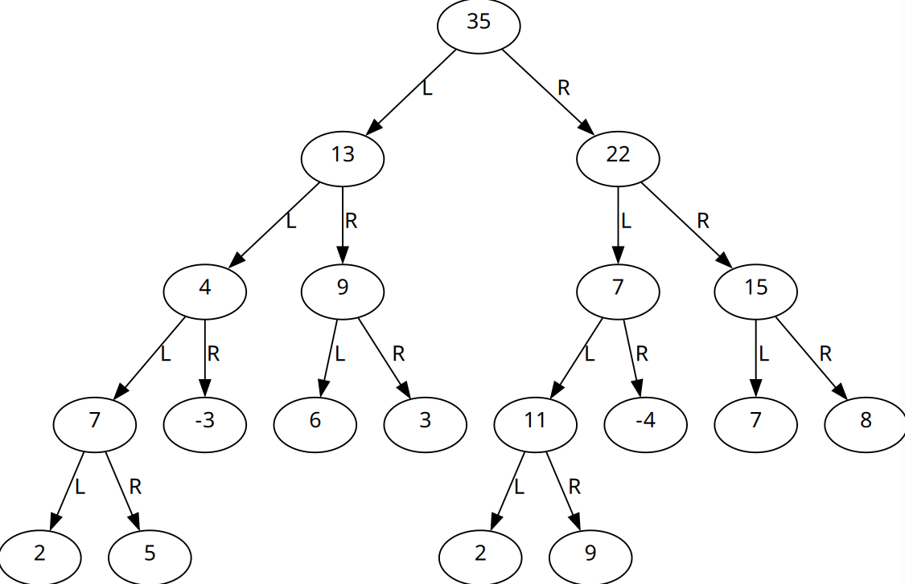

CSC 212 DSA Project: Segment Trees Developed by Amber Rastella, Giorgio Florentino, Junsheng Wu, and Michael Tedeschi

<b>Summary:</b> 
Our project is an implementation of a segment tree class called <code>SegmentTree</code>. Taking in an array of integers, the tree is built recursively from the bottom-up. The leaf nodes at the bottom represent each of the individual integers in the array. As we work our way up the tree, the nodes in the middle represent sums of the child nodes. Because the nodes in the middle are made up of <i>segments</i> of sums of the children, we see how the structure gets its name: Segment Tree. Finally at the top, we have the root node which is the sum of all integers in the input array. We use a method called <code>::insert()</code> to populate this tree, as well as update values later on. Another method, <code>::search()</code>, allows us to get the sum of a given range of indices of the input array utilizing this tree. Both of these methods run in <code>O(log n)</code>. A method called <code>::printDotFile()</code> allows for generation of a .dot file, providing a nice visualization of the tree.
  
<b>Feature list:</b>
<ul>
  <li>Implementation of <code>SegmentTree</code> class</li>
  <ol>
    <li><code>::insert()</code> method for populating SegmentTree with integers and updating values at a given index</li>
    <li><code>::search()</code> method for returning the sum of a given range of indices</li>
    <li><code>::printDotFile()</code> method for creating output .dot file to visualize the tree</li>
  </ol>
  <li>Documentation for <code>SegmentTree</code> class and the above methods is included in the <b>Documentation</b> section of this page</li>
  <li>Test cases & sample inputs for each of the methods in the source file</li>
</ul>
 
<b>Planning:</b> 
Because a <code>SegmentTree</code> is a more <i>abstract</i> data structure than some other types of objects, we do not pass any command line arguments into the program. It is expected that developers utilizing this code will include the class in larger programs and utilize our documentation here in order to make the <code>SegmentTree</code> fit their use-cases. For the sake of demonstration, we have also opted to include test cases & sample inputs showing the functionality of the <code>::insert()</code> and <code>::search()</code> methods.  Under the hood, we are utilizing overloaded recursive functions to navigate the tree and carry out operations, such as reading ranges or updating values.
   
 <b>Compilation Instructions:</b>
 <ul><li>The following command will compile the program using G++: <code>g++ segment.cpp -o programName</code></li></ul>
  
 <b>Runtime Instructions:</b>
 <ol>
 <li>Ensure the executable and the input text file are in the same directory</li>
  <li>Execute the program with the following command: <code>./programName</code></li>

  <li>An <b>output.dot</b> file will be generated. View this file with your favorite DOT file viewer</li>
  <ul>
    <li>We recommend using <a href="https://dreampuf.github.io/GraphvizOnline/">GraphvizOnline</a></li>
  </ul>
 </ol>
  
 <b>Sample Input/Output Screenshots:</b>
  
 
 This is the visualized <b>output1.dot</b> file representation of the initial array created with the following input: 
 <code>10
2 5 -3 6 1 2 9 -4 7 8</code> 
Where <i>10</i> is the amount of numbers and the 2nd line contains each of the integers.
Our sample code segment.cpp contains two test cases. The first is an insertion of the value 3 at the 4th index. Then a visualization <b>output2.dot</b>is produced:

We can see an updated value of 3 where the 1 used to be.
Finally, we reach the next test case where demonstrate a search of index range 3 through 5. This produces a result of 11, which we can see visualized as a node above the leaf nodes on the graph. We can manually confirm this by counting the leaf nodes and summing the respective range.

